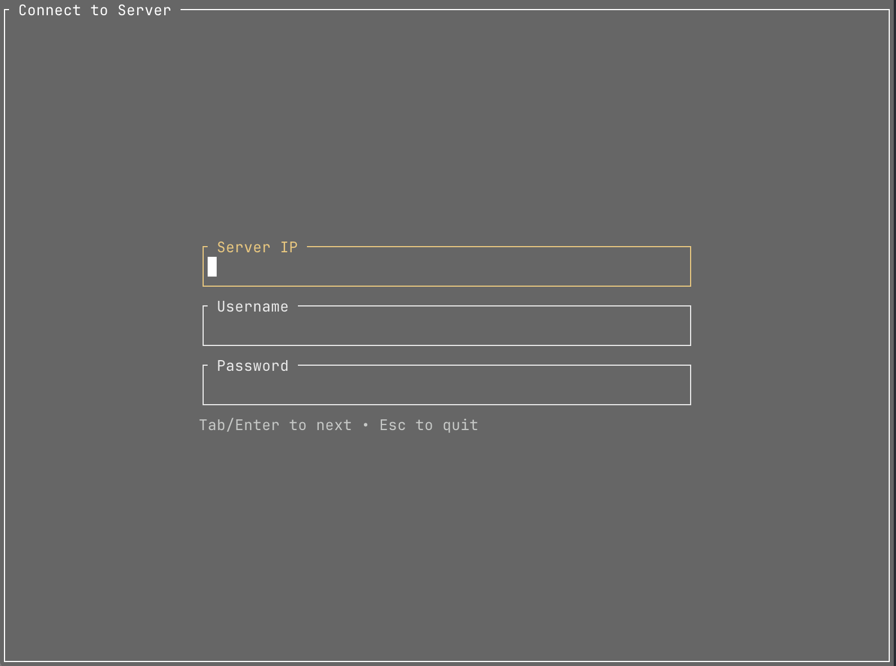
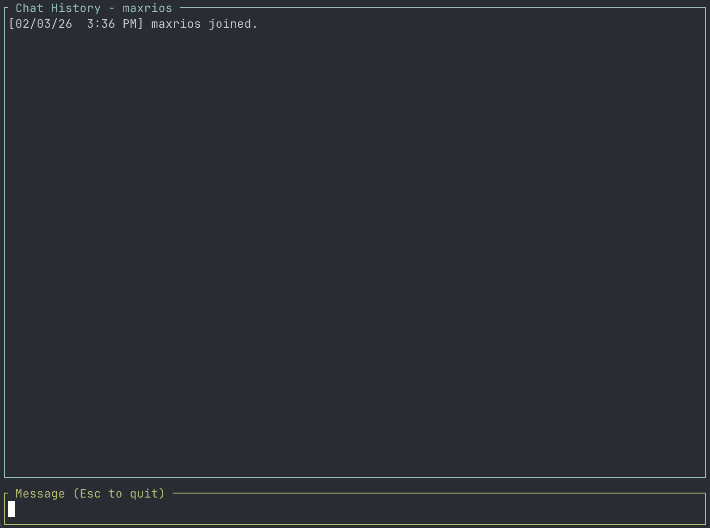

# **Max's Chat Service (MCS)**
A networking project to learn Rust🦀


<table><tr><td align="center"></td><td align="center"></td></tr></table>


## **Setting up Project**
This project uses TLS 1.2/1.3 for secure communication. Before running the application, you must generate self-signed certificates.

### **1. Set environment variables**
Rename the `.env.example` to `.env` and, optionally, replace with your own values.

### **2. Create Config File**
```
mkdir tls && cd tls
```

Create a `localhost.cnf` in the tls directory of this project to ensure the certificate works for localhost.
```
[req]
default_bits = 2048
prompt = no
default_md = sha256
distinguished_name = dn
req_extensions = req_ext

[dn]
CN = localhost

[req_ext]
subjectAltName = @alt_names

[alt_names]
DNS.1 = localhost
IP.1 = 127.0.0.1
IP.2 = 0.0.0.0
```

### **3. Generate Keys and Certificates:**
```
openssl genrsa -out ca.key 2048

openssl req -x509 -new -nodes -key ca.key -sha256 -days 1825 -out ca.cert -subj "/CN=localhost"

openssl genrsa -out server.key 2048

openssl req -new -key server.key -out server.csr -config localhost.cnf

openssl x509 -req -in server.csr -CA ca.cert -CAkey ca.key -CAcreateserial \
    -out server.cert -days 1825 -sha256 \
    -extensions req_ext -extfile localhost.cnf
```
If you're running your client on a separate machine, make sure to copy the `ca.cert` into the client repo `tls` directory.

### **4. Running the Server**
```
cd ..

docker compose up --build
```


### **5. Running the Client**
```
cargo run -p client
```
